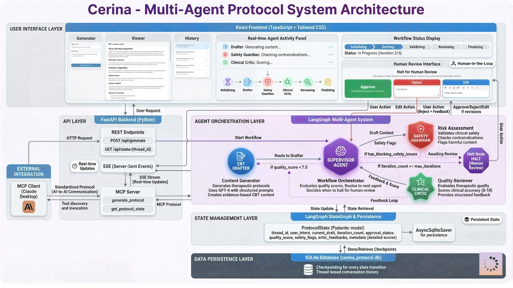

# Cerina Protocol Foundry 
An Autonomous Multi-Agent System for Clinical CBT Protocol Generation

## 📋 Overview

Cerina Protocol Foundry is an intelligent, multi-agent AI system designed to act as a "clinical foundry" for Cognitive Behavioral Therapy (CBT) exercises. Instead of a simple chatbot, it mimics a rigorous clinical review board.

The system uses a Supervisor-Worker agent topology to autonomously draft, critique, safety-check, and refine clinical protocols before presenting them for human review. It features a Human-in-the-Loop approval mechanism and full interoperability via the Model Context Protocol (MCP).

## 🎯 What Makes This Different

Unlike traditional chatbot-based therapy tools, Cerina operates as a clinical review board:

* **Not a chatbot:** Generates structured, evidence-based protocols, not conversational responses.
* **Multi-perspective review:** Every protocol passes through dedicated safety, quality, and clinical accuracy checks.
* **Deterministic safety:** Mandatory safety validation before ANY protocol reaches a human.
* **Audit trail:** Complete state history for clinical governance and compliance.
* **AI-to-AI composability:** Other AI systems can use Cerina as a specialized clinical tool via MCP.

## ✨ Key Features

🤖 **Hierarchical Multi-Agent Architecture:** A Supervisor agent orchestrates three specialized workers (Drafter, Safety Guardian, Clinical Critic) to ensure quality and safety.

🧠 **"Blackboard" State Management:** Agents collaborate using a shared, structured Pydantic state ("The Blackboard") to maintain context, version history, and scratchpads.

🛑 **Human-in-the-Loop (HITL):** The workflow halts automatically for human review. Users can Approve, Reject, or Edit drafts via the UI before finalization.

🔌**MCP Integration:** Fully compatible with the Model Context Protocol. Use clients like Claude Desktop to trigger protocol generation directly, bypassing the UI while retaining all safety checks.

💾 **Robust Persistence:** Uses SQLite/Postgres Checkpointers to save the graph state at every step. The system can crash and resume exactly where it left off.

⚡ **Real-Time Streaming**: The backend streams agent thoughts and actions in real-time via Server-Sent Events (SSE) and WebSockets.

🎯 **Conditional Routing:** Dynamic workflow paths based on quality scores, safety flags, and iteration count—not a fixed pipeline.

📈 **Structured Feedback**: Clinical Critic provides detailed scores across 5 dimensions with actionable revision suggestions.

🔍 **Complete Audit Trail:** Every state transition, agent decision, and quality score is persisted for clinical governance.

✅ **Evidence-Based Templates:** Drafter uses validated CBT frameworks (Beck, Ellis, Linehan) with citation support.

# Architecture





## Agent Topology (Supervisor-Worker)

The system avoids linear chains in favor of a central orchestration model:

    
    User[User / MCP Client] -->|Intent| Supervisor
    
    subgraph "Cerina Protocol Foundry"
        Supervisor{Supervisor Agent}
        Drafter[📝 CBT Drafter]
        Safety[🛡️ Safety Guardian]
        Critic[⭐ Clinical Critic]
        
        Supervisor -->|Route: Create/Revise| Drafter
        Supervisor -->|Route: Validate| Safety
        Supervisor -->|Route: Critique| Critic
        
        Drafter -->|Draft v1..N| Supervisor
        Safety -->|Safety Flags| Supervisor
        Critic -->|Quality Score| Supervisor
    end
    
    Supervisor -->|Quality >= 7.5| Halt[🛑 Human Review]
    Halt -->|Approve/Edit| DB[(Database)]
    Halt -->|Reject| Supervisor

### The Agents -

* **👔 Supervisor:** The workflow orchestrator. It manages the iteration loop, evaluates quality scores, and decides whether to route for revision or halt for human review.
* **📝 CBT Drafter:** Generates evidence-based therapeutic exercises (e.g., exposure hierarchies, cognitive reframing) using structured prompts.
* **🛡️ Safety Guardian**: Scans content for clinical contraindications, self-harm risks, and liability issues. It can block a draft even if the quality is high.
* **⭐ Clinical Critic:** Provides detailed feedback on empathy, tone, and clinical accuracy. It assigns a quality score (0-10) that determines if the loop continues.

## Technical Implementation

* **Framework:** LangGraph for stateful agent orchestration with conditional routing.
* **LLMs:** GPT-4 for drafting, safety and critique.
* **State Management:** Pydantic models with AsyncSqliteSaver for persistent checkpointing.
* **Real-time Updates:** Server-Sent Events (SSE) stream agent progress to the UI.
* **Frontend:** React + TypeScript with Tailwind CSS for responsive, real-time interface.

## 🚀 Getting Started

**Prerequisites**

* ```Bash
   Python 3.10+
   Node.js 18+ (for Frontend)
   API Keys for OpenAI (GPT-4) or Anthropic (Claude 3.5 Sonnet)
  ```

**1. Clone the Repository**

* ```Bash
   git clone https://github.com/yourusername/cerina-protocol-foundry.git
   cd cerina-protocol-foundry
  ```

**2. Backend Setup**

* ```Bash
   cd backend
  ```

### Create virtual environment
```Bash
python -m venv venv
source venv/bin/activate  # On Windows: venv\Scripts\activate
```

### Install dependencies
```Bash
pip install -r requirements.txt
```

**3. Environment Configuration**

```
Create a .env file in the backend/ directory:

Ini, TOML

# API Keys
OPENAI_API_KEY=sk-...
ANTHROPIC_API_KEY=sk-...

# Database
DATABASE_URL=sqlite:///./cerina_protocol.db

# App Settings
APP_ENV=development
LOG_LEVEL=INFO
```

**4. Run the Backend**
```Bash
python main.py
The API will be available at http://localhost:8000 API Documentation: http://localhost:8000/docs
```

## 📊 Quality Metrics

The system enforces strict quality gates before finalization:

Quality Score: Clinical Critic scores each draft 0-10 across 5 dimensions (empathy, accuracy, clarity, completeness, evidence-base).
Safety Threshold: Zero tolerance for blocking safety issues (self-harm risk, contraindications, liability concerns).
Iteration Limit: Configurable max iterations (default: 5) to prevent infinite loops.
Human Review Trigger: Automatic halt when quality ≥ 7.5 OR blocking issues detected OR max iterations reached.

## 💻 Usage Guide

**Option A: The Web Interface (Human-in-the-Loop)**

Navigate to the frontend/ directory and start the React app (instructions in frontend/README.md).

Open your browser to http://localhost:3000.

Generate: Enter a prompt like "Create a sleep hygiene protocol for insomnia".
Watch: Observe the agents working in real-time in the "Activity Panel".
Review: When the system halts, use the "Approve", "Edit", or "Reject" buttons to finalize the protocol.

**Option B: MCP Client (Claude Desktop)**

This project includes a fully functional MCP Server.

Configure Claude Desktop to use your MCP server. Add this to your Claude config file:

```text 
"mcpServers": {
  "cerina-foundry": {
    "command": "uv",
    "args": [
      "--directory",
      "/absolute/path/to/backend",
      "run",
      "mcp_server.py"
    ]
  }
}
```

**Restart Claude Desktop.**

Prompt Claude: "Ask Cerina to create an exposure hierarchy for social anxiety."

The system will bypass the UI halt (using the source="mcp" logic) and return the finalized, safety-checked protocol directly into your chat.

## 📂 Project Structure

```text

cerina-protocol-foundry/
├── backend/
│   ├── agents/                 # Agent Definitions
│   │   ├── supervisor.py       # Orchestration Logic
│   │   ├── drafter.py          # CBT Content Generator
│   │   ├── safety_guardian.py  # Safety Validation
│   │   └── clinical_critic.py  # Quality Assurance
│   ├── api/                    # FastAPI Routes
│   │   ├── routes.py           # Main Endpoints
│   │   └── websocket.py        # Real-time Streaming
│   ├── graph/                  # LangGraph Topology
│   │   ├── workflow.py         # Graph Construction
│   │   └── edges.py            # Routing Logic
│   ├── state/                  # Pydantic State Models
│   │   └── protocol_state.py   # "The Blackboard"
│   ├── database.py             # SQLite/Postgres Checkpointers
│   ├── main.py                 # App Entry Point
│   └── mcp_server.py           # MCP Integration Server
├── frontend/                   # React + TypeScript UI
└── README.md                   # You are here
```


## Evaluation Criteria Met

This project was built to satisfy specific architectural requirements:

Architectural Ambition: Implements a non-linear Supervisor-Worker pattern with self-correction loops, not a simple chain.
State Hygiene: Uses a typed Pydantic Blackboard (ProtocolState) to manage scratchpads, version history, and metadata scores.
Persistence: Every step is checkpointed to SQLite. The server can restart, and the "Human-in-the-Loop" flow resumes seamlessly.
MCP Integration: Features a dedicated mcp_server.py that allows LLMs (like Claude) to invoke the foundry as a tool, with special logic to bypass human review steps for autonomous execution.

## 📜 License

This project is licensed under the MIT License - see the LICENSE file for details.
Built for the Cerina "Agentic Architect" Sprint.
